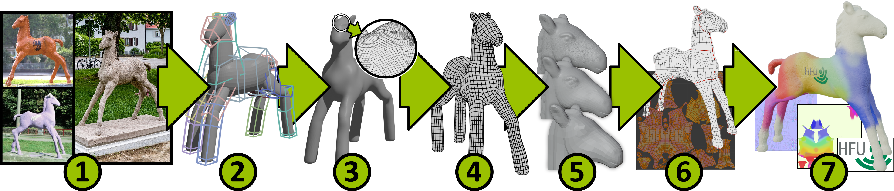

+++
title = 'Introduction'
draft = false
weight = 10 
+++

Following this course, you will learn how to create a 3D character and export it as a game asset. This will be done along a pre-defined process.

1. **Concept Art** contains visual conceptual material, either self-drawn, photographs of real objects or inspiration from the web or from AI. 
2. **Clay Block-Out** is a very first 3D adaption of your concept where you try to sketch your creation using simple and easily adjustable individual 3D objects (think of clay lumps). Thus you can iteratively adjust your creation to make it suit your imagination.
3. A more **Solid Block-Out** allows you to add more detail to work out the silhouette and the coarse shape language of your model. 
4. A process called **Retopology** will yield a 3D model with a reasonable polygonal mesh. 
5. **Multiresolution Editing** allows you to add more detail to your model - even as fine as irregular surface structures - without losing the decent mesh from the previous step.
6. **UV Unwrapping** unwinds your 3D mesh onto a 2D plane. It is the prerequisite for defining color, material settings and structure on a fine-grained level on your model
7. **Texture painting, Normal Map baking and exporting** will create version of your 3D-model ready to be used in a game engine.

We will use [Blender](https://www.blender.org/) as the main content creation tool. To verify that our asset can be used in a game engine, we will use [Godot](https://godotengine.org/) as an example game engine. 

We will *not* learn how to setup our 3D model for animation nor will we animate it during this course. Animation will be covered in subsequent modules.

Requirements

- A decent (not necessarily high-end) laptop or desktop computer running a contemporary operating system (Windows, macOS, Linux)
- Latest versions of Blender and Godot installed
- A 3-button mouse with mouse wheel. Ideally the middle mouse button is seperated from the mouse wheel (at least on Windows and Linux. Blender on macOS handles apple mice in a special way).
- Preferably a keyboard with a separate numeric keypad. If your Laptop doesn't have a seperate keypad, consider buying a cheap extra pad.

Additional hardware. This is not required but can be helpful for students planning focus on 3D modeling.

- Graphics tablet
- Space Mouse

