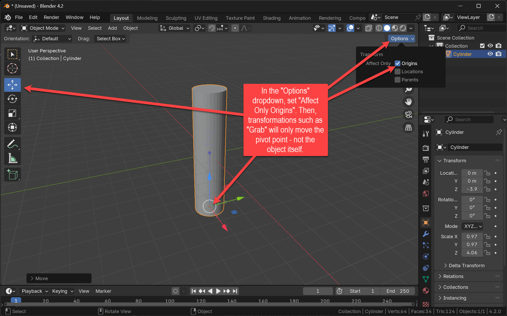

+++
title = 'Build a Bike'
draft = false
weight = 30
+++

Get familiar with navigating in 3D and using built-in 3D-objects (*primitives*) to block-out simple models.

## Assignment 

- Build a Bike
  - Use real-world dimensions in meters for all parts of your bike model. This helps ensure accuracy and makes your model compatible with other projects and assets. Find reference material from the internet or use the bicycle side view with dimensions provided below. Import as reference image into your 3D scene.
  - Don't get too detailed. Omit fine details such as the chain, the gear mechanics, brake system, etc.
  - For the wheels, use a round torus as the tyre and an edgy torus with only five minor segments as the rim.
  - Use the <kbd>RMB</kbd> + "Shade..." options wisely.
  - Use the built-in primitive geometries. Cylinders, mainly plus Torus objects and Cubes. Move, rotate, scale them
    - Use Hierarchy (parenting) to group objects to parts 
  - Transform objects' origins to ease alignment
  - Use the "Transformation orientation" and "Transform Pivot Point" settings
  - Use the 3D Cursor ("Cursor to Selected" and "Selection to Cursor" from the <kbd>Shift</kbd>+<kbd>S</kbd> menu, mainly)
  - Optional: Read about Blender's Snapping functionality and use it to align objects.
  - If appropriate, use the numerical transform parameters.

- Explain a good way to radially and evenly distribute the tube shaped spokes of a wheel!
- Explain the various parameters of each geometry primitive in the respective [_Adjust Last Operation panel_](https://docs.blender.org/manual/en/latest/interface/window_system/regions.html)!
- Where in your model did you use parent-child relationships and why?

## Material

- [Bicycle side view with dimensions](./bike_backdrop.png). Download the image and use it as a reference image.

- Blender Documentation
  - [Basic Transformations](https://docs.blender.org/manual/en/2.81/scene_layout/object/editing/transform/basics.html)
  - [Primitives](https://docs.blender.org/manual/en/2.81/modeling/meshes/primitives.html)
  - [Transform Orientation](https://docs.blender.org/manual/en/2.81/editors/3dview/controls/orientation.html)
  - [Pivot Point](https://docs.blender.org/manual/en/latest/editors/3dview/controls/pivot_point/index.html)
  - [Boolean Modifier](https://docs.blender.org/manual/en/2.81/modeling/modifiers/generate/booleans.html)
- _Snapping with Base Points in Blender 4_ (Blender Secrets, Vol 1 (Modeling Basics), page 18)

## Insights

### Shortcuts

| Shortcut            | Action                        |
|---------------------|-------------------------------|
| <kbd>G</kbd>        | Move                          |
| <kbd>R</kbd>        | Rotate                        |
| <kbd>S</kbd>        | Scale                         |
| <kbd>G</kbd>/<kbd>R</kbd>/<kbd>S</kbd>, <kbd>X</kbd>/<kbd>Y</kbd>/<kbd>Z</kbd> | Transform about axis. 2 x Axis-Key for local transform
| <kbd>Shift</kbd> + <kbd>D</kbd> | Duplicate object                |
| <kbd>Shift</kbd> + <kbd>S</kbd> | Cursor ("Snap") menu                      |

### Move an Object's Origin

Move the origin of objects (a.k.a. their ***Pivot Point***) to set the center of rotation and scale

### Booleans

Use boolean modifiers to mix the shapes of objects to create new, more complex shapes. E. g. use a cylinder to carve a hole in another cylinder et voilà: a wheel.

