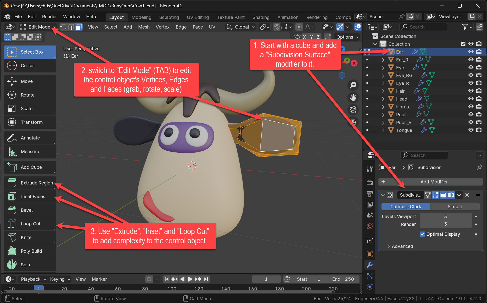

+++
title = 'Pancake Sausage Balls'
date = 2024-09-28T15:40:23+02:00
draft = false
weight = 40
+++

Modeling with virtual clay. Inspired by Rony Oren, everything is built out of balls, sausages and pancakes.

## Assignment 

- Build clay lumps out of a control cube and the Subdivision Surface modifier
- Form more (but not too) complex control shapes from the cube by...
  - ...changing to Edit mode
  - ...transforming faces, edges and vertices
  - ...adding Geometry using
    - Extrude
    - Loop Cut and Slide
    - Inset
- Try some simple characters (or only faces) inspired by the Rony Oren books
- Virtually clay-model your physical character from Visual I 
  - Collect reference images and organize them in PureRef
  - Generate T-Pose silhouette images and import them into blender
  - Fragment your character into simple shaped clay lumps
  - Roughly match your clay model's silhouette to the references. Don't go for full congruence. Rather focus on proportions at this stage
  - Model only one half and use the Symmetry

## Questions

- What criteria did you apply for your fragmentation? Show cases where you found it easy and cases where you found it difficult to find a good fragmentation.
- Describe ways to use reference images directly in Blender's 3D view
- Think of other object types than characters. List types that fit well with clay modelling and types that might be hard to clay model
- Explain the settings of the Mirror Modifier and how you adjusted them for your model.
- How many polygons does the Subdivision Surface Modifier create in one step from triangles, quads and n-gons, respectively? Draw how the subdivision of each of these face types is performed.

## Material

- Rony Oren books
- Blender Documentation
  - [Subdivision Surface Modifier](https://docs.blender.org/manual/en/latest/modeling/modifiers/generate/subdivision_surface.html)
  - [Extrude](https://docs.blender.org/manual/en/2.80/modeling/meshes/editing/duplicating/extrude.html)
  - [Loop Cut and Slide](https://docs.blender.org/manual/en/latest/modeling/meshes/editing/edge/loopcut_slide.html)
  - [Mirror Modifier](https://docs.blender.org/manual/en/latest/modeling/modifiers/generate/mirror.html)
- _Loop Cut and Slide Tips_ (Blender Secrets, Vol 1 (Modeling Basics), page 24)
- _Loop Tools_ (Blender Secrets, Vol 1 (Modeling Basics), page 27)
- [The Double Subdiv Method (Blender Secrets)](https://www.youtube.com/watch?v=13UN1Lju5Hs)

## Insights

### Clay Modeling

Create clay lumps using a cube with a Subdivision Surface modifier.

### Symmmetry

Use symmetry modifiers to model only one half of the model and to create perfectly symmetrical shapes (if the concept allows for that). Small variations between left and right can be added at later stages. 
Be aware of objects that need to be cut in half (such as a character's torso) and objects that need to be duplicated (such as arms and legs)

