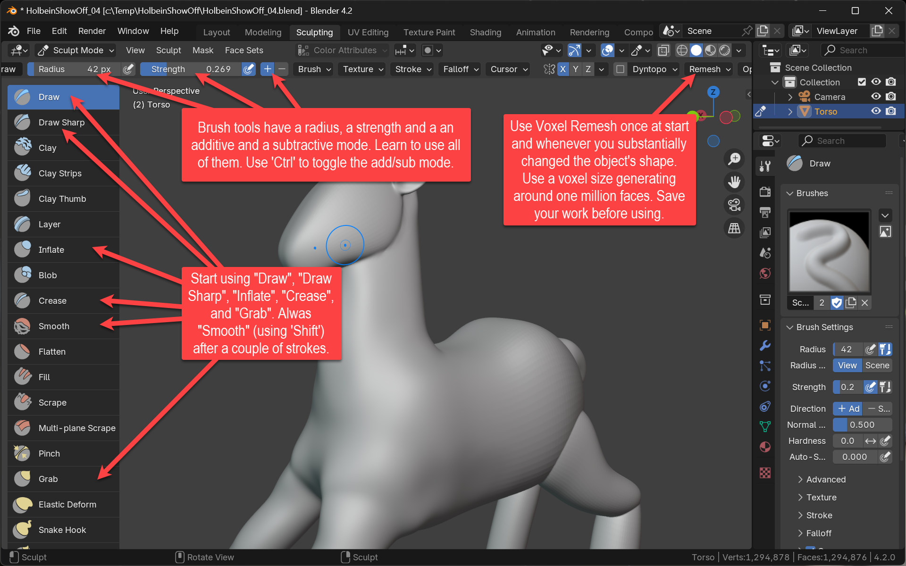

+++
title = 'Blockout - Silhouette-wise'
date = 2024-09-28T15:40:23+02:00
draft = false
weight = 50
+++

Learn basic sculpting tools. Use them to make the simple clay model match the intended shapes.

## Assignment 

- Sculpt your clay model to make it better match the original
  - Use the sculpting Workspace
  - Use the Remesh command at the top right of the 3D View
    - Once to start
    - From time to time in-between
    - Save before using it
    - Alternatively use Dyntopo automatically retopologize the sculpted geometry
  - Prefer these brush types
    - Draw (sharp)
    - Smooth
    - Inflate
    - Grab
- Concentrate more on silhouettes' congruency with reference
- Do not go into details (at this time) such as cloth or muscle surface patterns, skin structure, wrinkles, etc.

## Questions

- What happens if you (mis)use Inflate/Grab to model extrusions?
- How can you change the influence radius of the current tool?
- Explain the differences and the pros and cons of the three resolution adaption methods described in the "Adaptive Resolution" article (see Material below), at least for the first two methods (Voxel Remshing and Dyntopo). We will use the Multiresolution approach in a later step anyway.
- Did you try each tools' inverted effect (+/-)?
- Did you try a graphics tablet?

## Material

- Blender Documentation
  - on the sculpting tools used
  - [Adaptive Resolution](https://docs.blender.org/manual/en/latest/sculpt_paint/sculpting/introduction/adaptive.html)
- _Sculpting_ is an entire chapter in Blender Secrets (Vol 5 (Sculpting), page 740) although many of the techniques described there do not apply on this task. Read over it anyway to get an overview on the various facets of sculpting.
- Practice, practice, practice!

## Insights

### Sculpting basics

The following screenshot is taken in the sculpting workspace which automatically sets the 3D Editor into sculpting mode.

