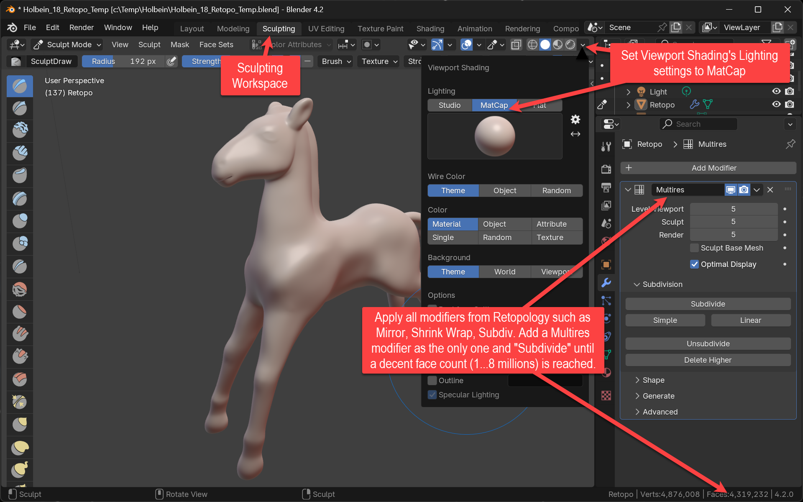
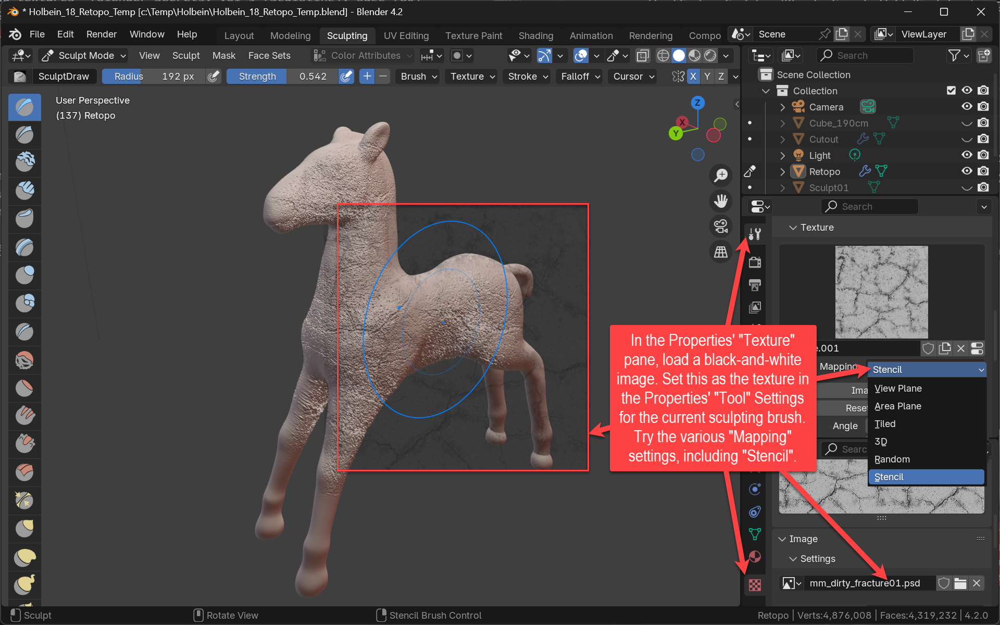

+++
title = 'Details in Multires'
date = 2024-09-28T15:40:23+02:00
draft = false
weight = 70
+++

Sculpt again, now simultaneously in multiple polygonal resolutions.

## Assignment 

- Add a *Multiresolution* Modifier to your retopo object
  - Hit the *Subdivide* button until your object's face count is between one and four million faces (stop earlier if your computer doesn't stand that many faces).
- Sculpt details such as surface structure into your multiresolution model 
  - Do **not** use Dyntopo or the Remesh option
  - If necessary: try sculpting coarse structures directly into coarser resolutions (change them in the Multiresolution modifier settings)
  - Make sure to not substantially change the silhouette any more:
    - Good Changes:
      - Facial and body features: eye lines, ear details, contours, small bulges, details of muscle structure, wrinkles etc.
      - Cloth and skin structure
      - Ornament on props (weapons), armour and clothes
      - Mechanical details: folds, screws, pipes, wires attached to the surface
    - Bad changes (these should have been added in the blockout)
      - Extremeties: legs, arms, tails, tentacles
      - Protruding mechanical parts: struts, hydraulic rams
      - Facial parts: entire ears, noses
      - Deep indentations
- Try using advanced sculpting techniques such as _Sculpting with Textures and Stencils_ (see Material) and other methods mentioned in the _Sculpting_ volume (5) of Blender Secrets

## Questions

- Explain the Multiresolution Modifier. Where is the difference to the Subdivision Surface Modifier?
 

## Material

- _Sculpting with Textures and Stencils_ (Blender Secrets, Vol 5 (Sculpting), page 751)
- _Sculpting Sword Details Using Alpha textures_ (Blender Secrets, Vol 5 (Sculpting), page 780)
- _Hard Surface Sculpting_ (Blender Secrets, Vol 5 (Sculpting), page 768)
- [Free sculpting texture brush downloads from ZBrush](https://pixologic.com/zbrush/downloadcenter/alpha/)

## Insights

### Prepare for Multires Sculpting

Use a multiresolution modifier (as the only modifier) on your retopologized character and have the multiresolution blow up your face count to a number capable of displaying finest details. Use the MatCap display viewport shading to show finest nuances on your object's surface geometry.

### Sculpt Details using Texures

To sculpt fine details such as skin, fur, cloth or other surface structures, consider using a black-and-white texture encoding the spacial surface structures as gray scales (See [Material](#material) for free brush images).

