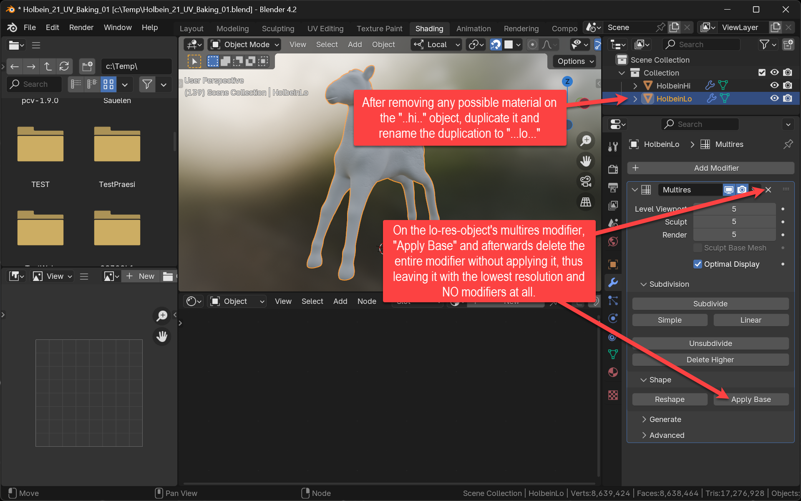

+++
title = 'Normal Baking'
date = 2024-09-28T15:40:23+02:00
draft = false
weight = 100
+++

Step-by-step from the high-poly sculpting result to a low-poly version with all the high-detail structure baked into a normal map.

## Step 1 - Prepare for baking

## Step 2 - Low-Poly from High-Poly Model

## Step 3 - Create a Texture for the Normals

## Step 4 - Bake It!

## Step 5 - View/Optimize the Result

