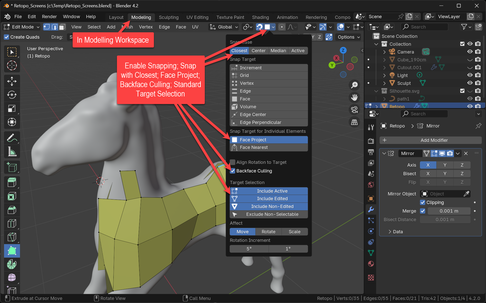
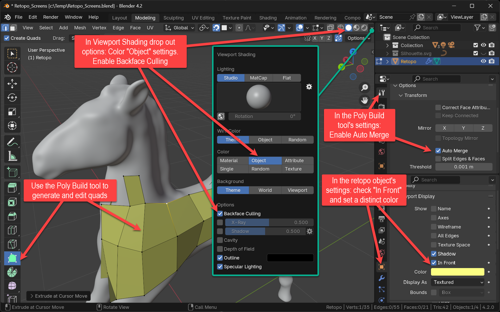
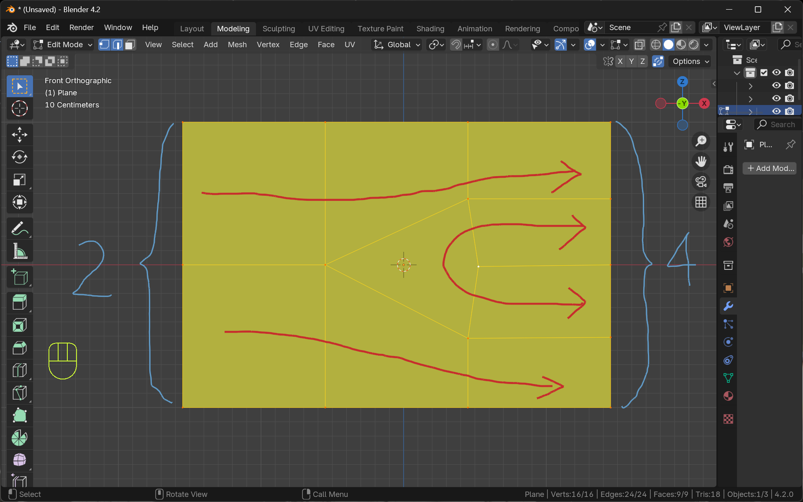
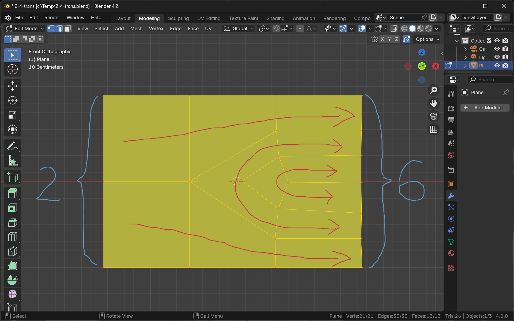
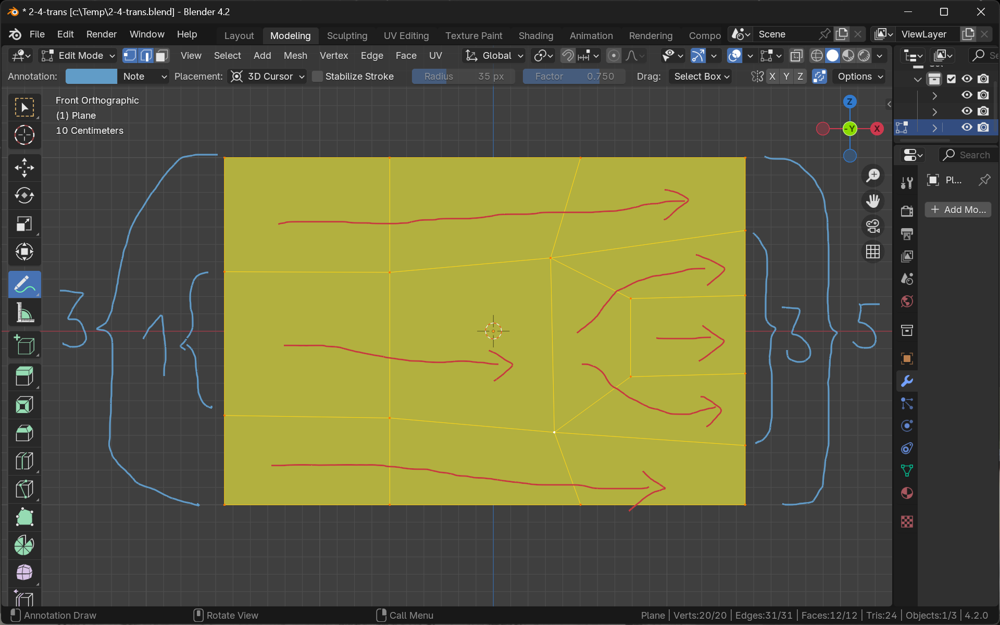
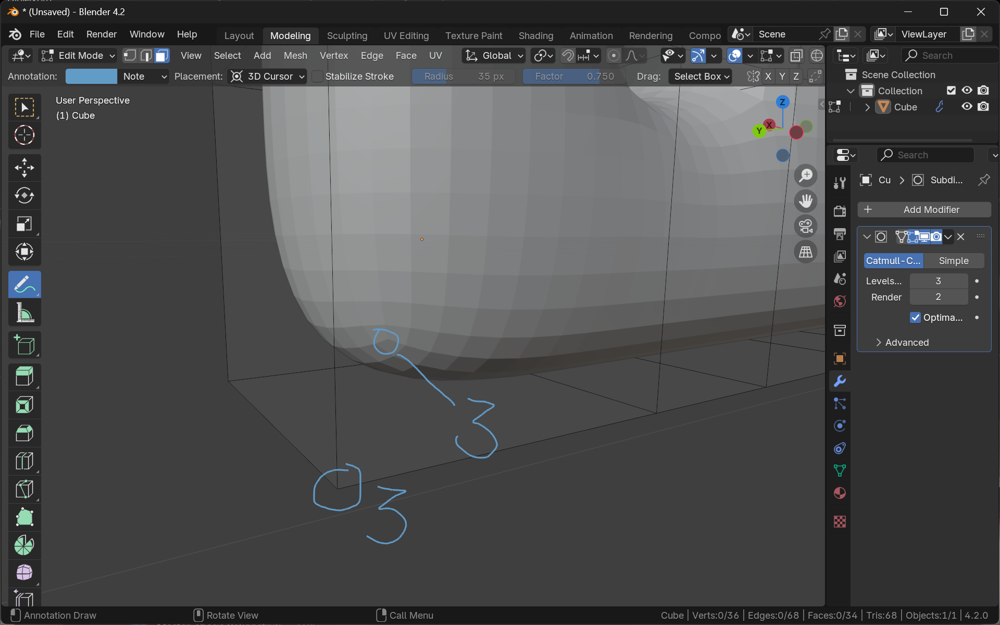
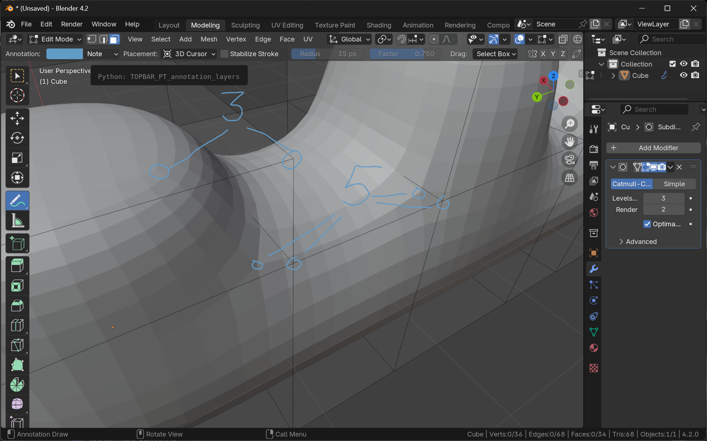
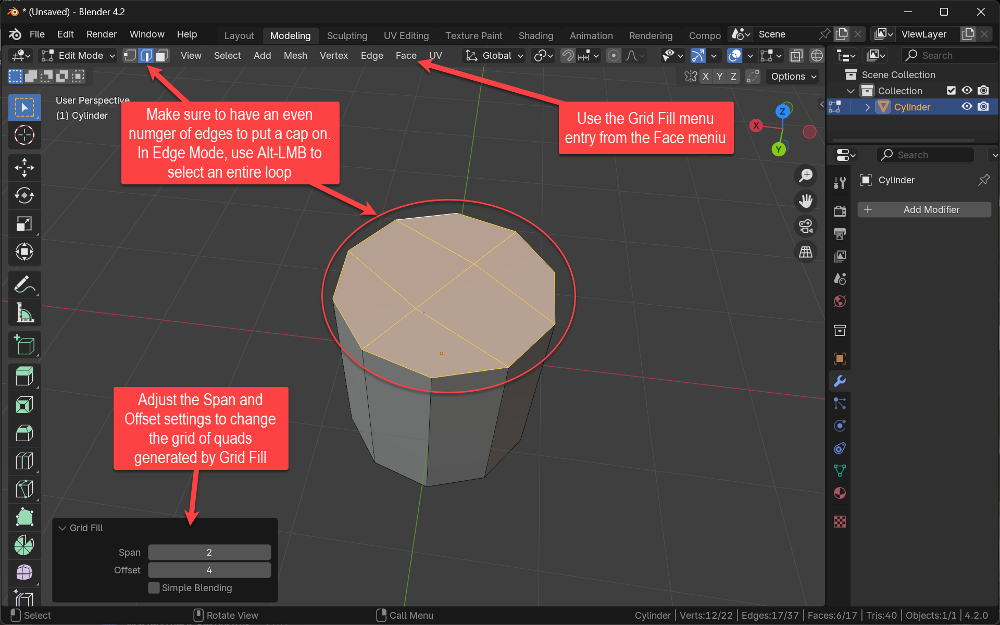

+++
title = 'Retopology - Know Your Quads'
date = 2024-09-28T15:40:23+02:00
draft = false
weight = 50
+++

Generate a simple geometry made out of quads only with edge loops following your character's features.

## Assignment 

- Retopologize your model
  - Name your existing model "..._orig"
  - Start from scratch with a plane-only object. Name it "..._retopo"
  - Set snapping settings to have edits on the new ("...retopo") object slide on your "...orig" object
  - Set the visibility settings 
    - to backface culling (to only see the front of the faces), 
    - to let the retopo object always appear on top and 
    - to display it with a custom (highlight) color
  - Use the Poly Build tool in edit mode to build structures
  - Use the Fill and Grid Fill commands
  - Create ONLY QUADS. No Tris, no n-gons. Quads. 
- Find tutorials on 
  - "good" topology
  - importance of quads
  - Retopolgy process like this one: [Retopology in Blender (Beginner Tutorial)](https://www.youtube.com/watch?v=X2GNyEUvpD4)
 

## Questions

- What did your research on "good topology" yield? Discuss various aspects
- Why are quads important?
- What is "back face culling". What is a "back face" in the first place? How do you turn a back face into a front face?

## Material

- _Retopology Tips_ (Blender Secrets, Vol 6 (Retopo-UVs-Baking), page 939)
- _Quad Topology Tips_ (Blender Secrets, Vol 2 (Modeling), page 230)

## Insights

### Snapping

Set Blender snapping to "Face Project". This will slide the retopology object's vertices on the original sculpt model.

### Visibility and Poly Build

Tweak the visibility settings to display the retopo object in an easy-to-use way. Use the Poly Build tool to create new quads and edit their vertices at the same time.

### Criteria for "Good" Topology

- Quads only
- Most vertices span four edges and four quads. Only few vertices (called _poles_) connect three or five edges/quads. Avoid poles with more than five connecting edges/quads. 
- "Good" Edge/Polygon-Flow
  - "Loop cut test" suggests simple and clear loops. No spiraling loops
  - Adding detail at most places is as simple as a loop cut
- Think cloth! 
- Animation safe
  - At hinges and joints: Edges are always either in the line of displacement or in the line of the hinge's axis.
  - Denser polygon resolution where much distortion by animation is expected
  - Rings around areas with much distortion by animation (e.g. mouth, eyes)

### Hands-on Tips for Retopology

#### N → M Transitions

When Laying out quad topology along a certain direction with a number of quads (n), it is often desired to change that number. If the geometry becomes smaller along the progress direction, the width of the progressing "quad front" needs to be made out of less (m) quads or vice versa (in case the geometry becomes bigger). Imagine progressing a cylindrical quad front along a leg. At places where the leg becomes thinner, you want the cylinder rings to be made out of less quads. How do you add more "lanes"  to the edge/polygon flow without introducing triangles or n-gons?

**Bad news:** It is impossible to transition from an even to an odd quad count or vice versa.

**Good news:** Almost every (m→n) with _both_, m _and_ n being either even or odd transition can be reduced to a 2 → 4 (or 4 → 2) transition.

The following image shows a 2 → 4 transition. The red arrows depict the progress direction. 

This can easily be expanded to a 2 → 6 transition by adding a second lane to the inner U-turn quad flow. As a result this transition contains a rare case where a pole with six connecting edges is acceptable (assignment: find it!).

As an example for a transition between odd numbers the following image simultaneously shows a 1→3 transition which can be seen as the kernel of a 3→5 transition.

#### Think Subdiv: 3- and 5-Poles

Observe how a subdivision surface modifier generates nice 4-edge-vertices at almost every part of the geometry. The only exception is where the control geometry contains corners (3-Poles) and extrusions (5-Poles). Use this rule for your hand-made retopology.

##### 3-Poles at Caps and Lids

At places where an elongated part of the object ends with a cap- or lid-like closure, the loop of edges making up the boundary between the lateral surface and the cap typically contains up to four 3-poles (vertices with only three connecting edges) while all other vertices connect four edges.

##### 5-Poles at Extrusions and Extremities

An edge loops making up the boundary between a base part and a part extruded from the object (such as the body and an arm of a character) typically contains up to four 5-poles.

#### Use Grid Fill for Caps

To close an elongated part with a cap, use the grid fill command (works only if the loop around the elongation is made out of an even number of quads/edges).

