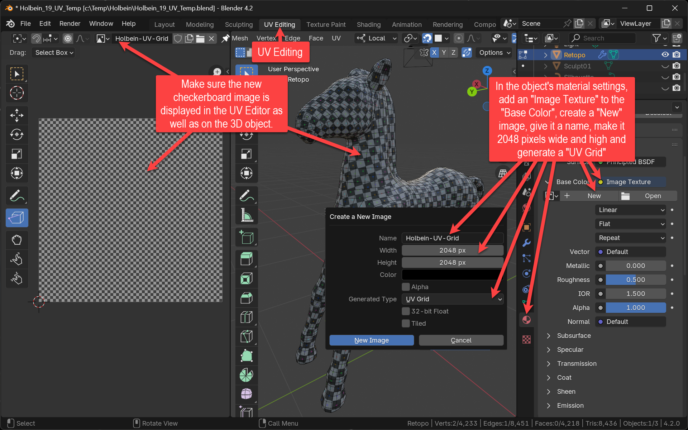
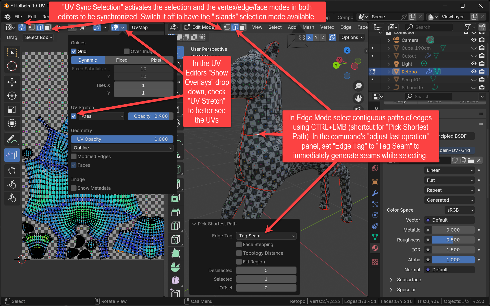

+++
title = 'UV Unwrapping'
date = 2024-09-28T15:40:23+02:00
draft = false
weight = 70
+++

Unfold the threedimensional topology onto a flat 2D plane. This will allow textures to control the visual appearance of the object's surface material.

## Assignment 

- Prepare for UV editing:
  - Switch to the UV Editing workspace
  - Create a material on the character object and add a new texture to its base color. When creating the new texture, set its size to 2048x2048 pixels, set the "Generated Type" to "UV Grid" and give it a name. In the UV Editor's top bar, select the newly created texture.
  - From the UV Editor's top bar (in Edit Mode) switch on (and sometimes off) the "UV Sync Selection" setting.
  - In the UV Editor's "Overlays" drop down, check the "UV Stretch" setting and set it to "Area".
  - In the UV Editor's "UV" menu, check the "Live Unwrap" setting.
- Mark Seams:
  - Research good seam positions for your type of character.  
  - In the 3D Editor (in Edit mode with Edge editing selected), mark a line of connecting edges using <kbd>CTRL</kbd>+<kbd>LMB</kbd> ("Pick Shortest Path).
  - In the "Pick Shortest Path" Adjust Last Operation panel (showing up at the bottom of the 3D editor or using <kbd>F9</kbd>) set "Edge Tag" to "Tag Seam"
  - From time to time select all Edges and hit "Unwrap"
- Fine-tune the UV map:
  - In the UV Editor's "UV" menu, use the "Pack Islands" menu item.
  - In the 3D Editor, select all object's edges (or vertices or faces).
  - In the UV Editor's top bar, turn off "UV Sync Selection", then set the "UV selection mode" to "Island". Now click on individual islands and use the common Grab/Scale/Rotate commands to adjust the islands on the entire UV canvas.

## Questions

- Did you grasp the technical background of textures and UVs (a.k.a. _texture coordinates_)?
  - Why are UVs called UVs?
  - Where are those UV coordinates stored? 
  - In which bounds (minimum and maximum values) do u- and v- values typically range?
  - What if u or v are smaller or bigger than this range?
- Where did you set your seams and why? 

## Material

- [Blender Manual -- Seams](https://docs.blender.org/manual/en/latest/modeling/meshes/uv/unwrapping/seams.html)
- _Unwrap Like a Pro Using Live Unwrap_ (Blender Secrets, Vol 6 (Retopo/UVs/Baking), page 988)

## Insights

### Prepare for UV Unwrapping

Use a generated checkerboard control texture as a material's "Base Color".

### Mark Seams

Use CTRL+LMB with "Tag Seam" to directly paint seams. Toggle "UV Sync Selection" for different features such as marking islands

